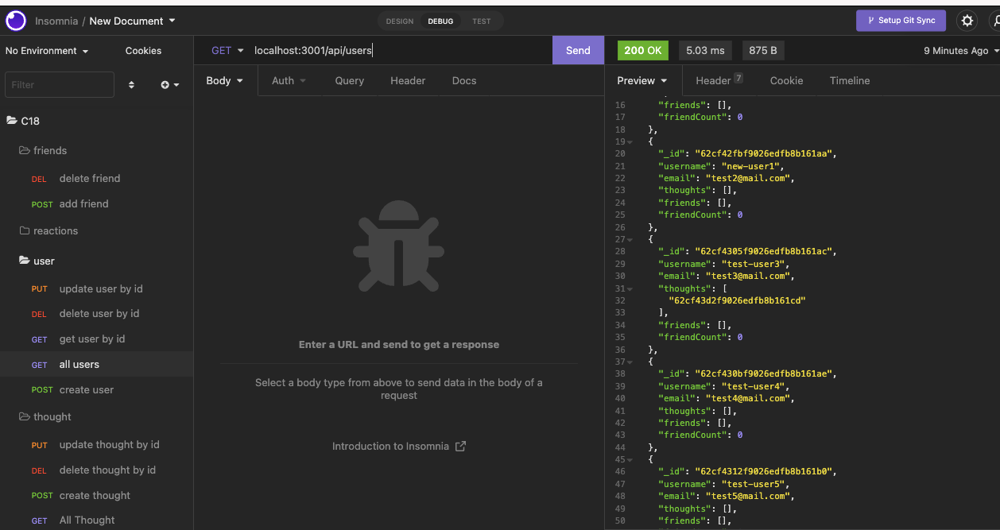

# super-doodle

## Social Network - Challenge Assignment 18 NoSQL

- *What was your motivation?*  I wanted to be able to create the backend for a social network
- *Why did you build this project?*  To create the backend for a social network using a NoSQL database. 
- *What problem does it solve?*  It solves the problem of needing the backend for a social network
- *What did I learn?* I learned how to create models for a MongoDB. I familiarized myself with mongoose

## Installation

*What are the steps required to install your project? Provide a step-by-step description of how to get the development environment running.*

Download all of the files from the repo. Then from your terminal run 'npm i' to install the packages associated with this project. 

## Usage

*Provide instructions and examples for use. Include screenshots as needed.*

To run the application, after you have downloaded the files and completed the installation steps above. From your terminal you will want to run 'npm start' to start the server, and then in Insomnia you can create, update and delete users and thoughts.  You can add friends to users by ID and you can add reactions to thoughts by ID.

Below is a screenshot of Insomnia after I ran a GET request for all users.  

There is also a [Video Link](https://youtu.be/d1_hSVn9qmo)

## Credits
I used the MongoDB docs for reference, as well as the activities in this module.
